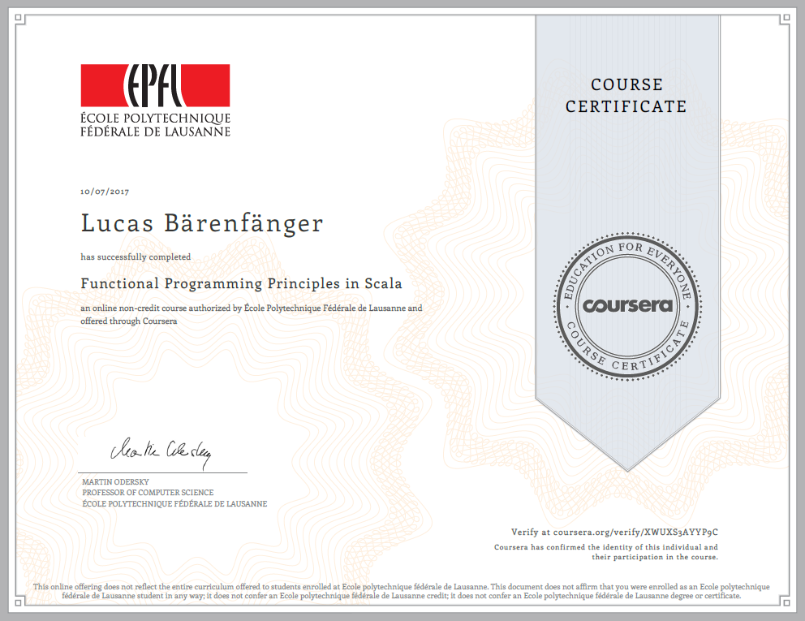

# Notes on "Functional Programming Principles in Scala"

## Overview

These are my notes on Martin Odersky's Coursera course "Functional Programming Principles in Scala". They are mostly based on the slides, sprinkled with occasional comments by me. This course can be found at https://www.coursera.org/learn/progfun1/.

## Table of Contents

+ [Week 1 -- Functions & Evaluation](notes/week_1.md)
+ [Week 2 -- Higher-Order Functions](notes/week_2.md)
+ [Week 3 -- Data and Abstraction](notes/week_3.md)
+ [Week 4 -- Types and Pattern Matching](notes/week_4.md)

Due to a lack of time, I was not able to takes notes on week 5 and week 6.

## Credit

All the credit goes to the author of the course, Martin Odersky ([@odersky](https://github.com/odersky)).
